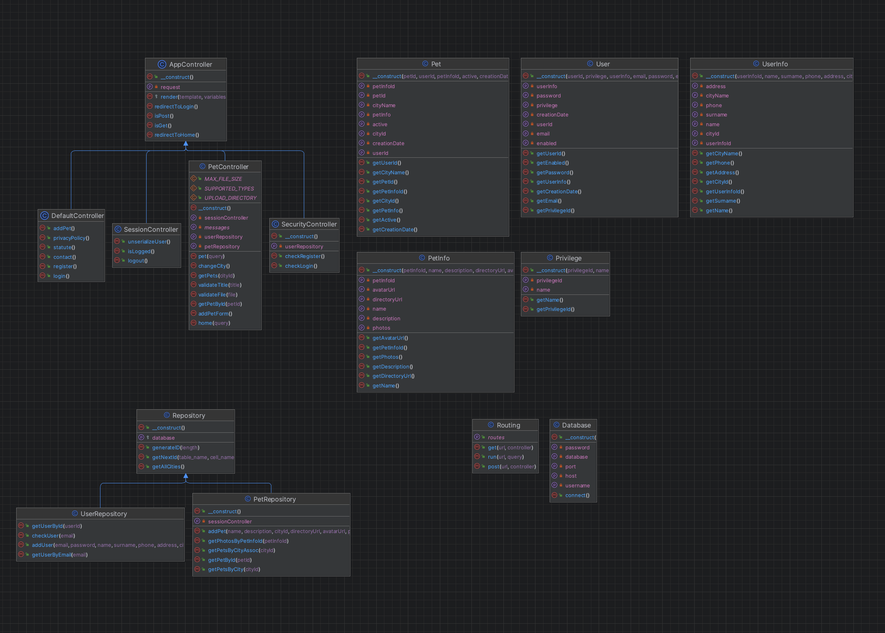
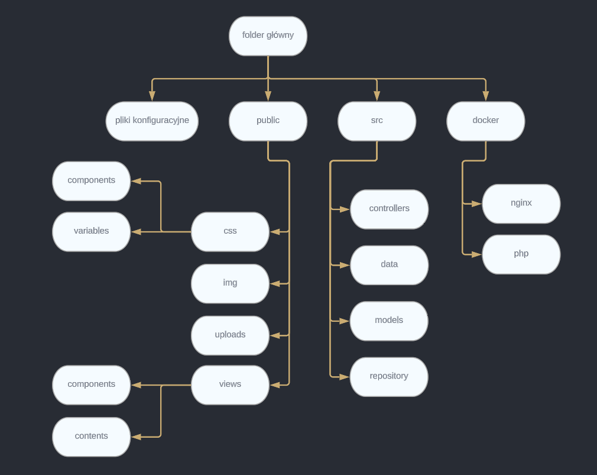
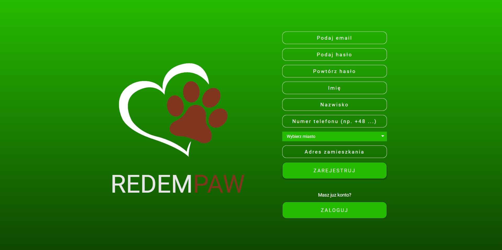
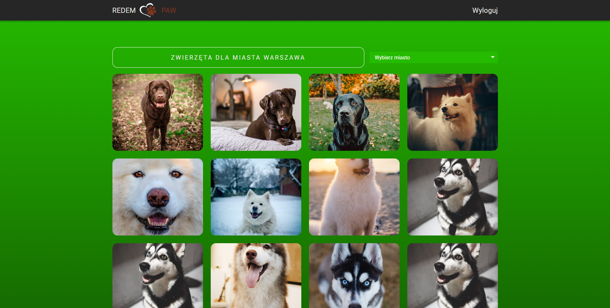
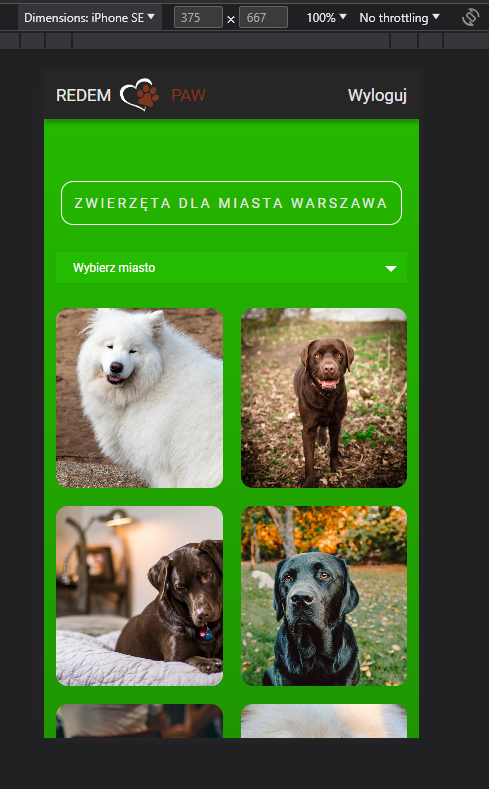

# RedemPAW

## Cel projektu:

Stworzenie aplikacji pozwalającej użytkownikom przeglądaj, jak i tworzyć ogłoszenia odnośnie zwierzaków szukających nowego domu. Aplikacja powstała głównie z myślą o zapewnienie godnego życia dla zwierząt czekających na swoją chwilę w schroniskach.

## FUNKCJONALNOŚCI:

- logowanie
- rejestracja
- wylogowywanie
- przeglądanie aktualnych wpisów
- wyświelenie jednego wpisu
- wyszukanie wpisów w zależności od miasta
- dodanie wpisu

## DIAGRAM UML KLAS:

## DIAGRAM ERD BAZY:

## STRUKTURA FOLDERÓW:

## FIGMA:

[Kliknij tutaj]: https://www.figma.com/file/ZoEKdd82jdXUYH6LFsiTPp/Untitled?type=design&node-id=1%3A3&mode=design&t=4QemBiYVh9muGkZP-1

## PRZYKŁAD DZIAŁANIA:

#### Przy pierwszym wejściu na stronę mamy możliwość zalogowania się, lecz nie mając konta klikamy przycisk zarejestruj.

#### Do rejestracji potrzebujemy użyć email'a którego jeszcze nie ma w bazie danych, oraz haseł które się zgadzają. Jeśli choć jedna z tych rzeczy nie zostanie spełniona, system nas o tym poinformuje tym samym przerwie nasz proces rejestracji. W momencie kiedy wszystko będzie się zgadzało utworzy nasze konto.

#### Po zalogowaniu się ujrzymy wszystkie widoczne wpisy dla miasta, które podaliśmy podczas rejestracji. Na szczęście nie ma obawy, gdyż w każdym momencie możemy ustawić nasz "search-bar" na miasto jakie tylko chcemy. Dodatkowo przy najechaniu na jakikolwiek wpis, zostanie on lekko zwiększony oraz pokaże nam kilka informacji, takich jak imię zwierzaka czy początek opisu.

#### Każdy widok naszej aplikacji jest w 100% responsywny dlatego możemy cieszyć się naszym projektem na urządzeniach stacjonarnych jak i mobilnych.

#### Po wejściu w jakikolwiek wpis jesteśmy w stanie zobaczyć dodatkowe informacje o zwierzaku takie jak: imie, opis, dane kontaktowe właściciela oraz zdjęcia.

#### Po przejściu do podstrony "dodaj zwierzaka" (addpet), znajdującej się w stropce strony, jesteśmy w stanie dodać nowy wpis. Potrzebujemy do tego imię pupila, dokładny opis oraz zdjęcia.

#### Po poprawnym utworzeniu naszego wpisu jesteśmy w stanie podziwiać jego rezultat.

#### Jeśli mamy już wszystko co chcieliśmy możemy na spokojnie się wyglogować, a strona sama zabierze nas do początkowej strony logowania.

## UŻYTE WZORCE PROJEKTOWE:

### - MVC

W projekcie opartym na wzorcu Model-View-Controller (MVC), modele pełnią kluczową rolę w reprezentowaniu danych aplikacji. Umieszczenie modeli w folderze "src/models" ma na celu wyodrębnienie ich jako oddzielnych komponentów odpowiedzialnych za reprezentację danych i definiowanie struktury informacji.

Modele w folderze "src/models" są obiektami, które reprezentują strukturę danych aplikacji. Odpowiadają za definiowanie właściwości i zachowań tych danych, niezależnie od logiki biznesowej. W przypadku, gdy logika biznesowa jest wyodrębniona do repozytorium, modele skupiają się głównie na reprezentowaniu danych i nie zawierają logiki.

Folder "src/repository" zawiera repozytorium, które jest odpowiedzialne za obsługę logiki biznesowej aplikacji. Repozytorium pobiera, przetwarza i zapisuje dane, korzystając z modeli do reprezentacji tych danych. Logika biznesowa jest zaimplementowana w repozytorium, a modele są wykorzystywane jako struktury danych.

Kontrolery, które znajdują się w folderze "src/controllers", obsługują żądania użytkownika i komunikują się zarówno z repozytorium, jak i widokami. Kontrolery pobierają dane z repozytorium za pomocą odpowiednich metod, a następnie przekazują je do widoków w celu wyświetlenia.

Folder "public/views" zawiera pliki, które odpowiadają za prezentację danych użytkownikowi. Widoki wykorzystują modele do wyświetlania danych w czytelnej i atrakcyjnej formie. Kontrolery korzystają z repozytorium, aby pobierać dane, a następnie przekazują je do odpowiednich widoków w celu ich prezentacji.

Podsumowując, modele w folderze "src/models" reprezentują strukturę danych aplikacji, a repozytorium w folderze "src/repository" obsługuje logikę biznesową. Kontrolery w folderze "src/controllers" obsługują interakcje między warstwą prezentacji a danymi, a widoki w folderze "public/views" odpowiadają za prezentację danych użytkownikowi. Dzięki temu podziałowi odpowiedzialności i strukturze projektu opartej na MVC możliwe jest lepsze zarządzanie kodem i rozdzielenie różnych aspektów aplikacji.

### - Repository Pettern

Wracając do folderu "src/repository" warto zauważyć kolejny wzorzec projektowy znajdujący się w aplikacji, który umożliwia separację logiki dostępu do danych od reszty aplikacji w kontekście wzorca Model-View-Controller (MVC). Repozytorium zawarte w tym folderze obsługuje operacje CRUD (Create, Read, Update, Delete) na danych w bazie. Jego głównym celem jest zapewnienie jednolitego interfejsu do manipulacji danymi, bez konieczności bezpośredniego kontaktu z bazą danych. W ten sposób wzorzec Repository ułatwia zarządzanie danymi i wprowadza elastyczność w przypadku ewentualnych zmian w źródle danych, zachowując jednocześnie separację logiki dostępu do danych od innych komponentów aplikacji w kontekście MVC.

### - Dependency Injection

Wstrzykiwanie zależności (DI) polega na przekazywaniu obiektów, które są wymagane przez daną klasę, zamiast tworzenia ich bezpośrednio wewnątrz klasy. Poprzez zastosowanie DI, klasy nie muszą być świadome, jak ich zależności są tworzone lub zaimplementowane, co prowadzi do luźnego powiązania i większej elastyczności w projektowaniu aplikacji.

W przypadku struktury katalogowej "src/controllers", "src/models" i "src/repository", można wykorzystać kontener DI do zarządzania zależnościami. Kontener DI, taki jak popularne biblioteki czy frameworki, umożliwia łatwe skonfigurowanie i dostarczenie wymaganych zależności dla klas w aplikacji. Dzięki temu można łatwo wymieniać implementacje poszczególnych komponentów, a także testować je niezależnie poprzez dostarczanie im zależności w kontekście testowym.

Wykorzystanie DI w projekcie pozwala na większą modularność, skalowalność i testowalność kodu. Pozwala również na łatwe wprowadzanie zmian w implementacji poszczególnych komponentów, ponieważ zależności są wstrzykiwane i konfigurowane na poziomie kontenera DI, a nie na poziomie kodu, co minimalizuje wpływ zmian na inne części aplikacji.

### - Front Controller

W pliku index.php, po rozpoczęciu sesji, następuje parsowanie ścieżki z żądania HTTP. Wykorzystywany jest klasa Router, która definiuje mapowanie ścieżek żądań na konkretne kontrolery.

Wszystkie te mapowania ścieżek są zdefiniowane w Routerze, który następnie wywołuje metodę run(), przekazując w parametrze zparsowaną ścieżkę z żądania. To powoduje obsługę żądania przez odpowiedni kontroler na podstawie mapowania.

Dzięki zastosowaniu wzorca Front Controller w pliku index.php, wszystkie żądania są skierowane do jednego punktu wejścia, co ułatwia zarządzanie i routowanie żądaniami w aplikacji.

### - Singleton

Wzorzec Singleton jest wykorzystywany w klasie Database.php, która implementuje jednostkową instancję (singleton) dla zarządzania połączeniem z bazą danych.

Klasa Database.php zapewnia tylko jedną instancję połączenia z bazą danych, co eliminuje potrzebę tworzenia wielu instancji tego samego połączenia i oszczędza zasoby systemowe. Wzorzec Singleton jest używany w celu zapewnienia globalnego dostępu do tej jednej instancji w różnych miejscach aplikacji.

Przykładowo, w klasie Database.php zdefiniowana jest statyczna metoda getInstance(), która zwraca instancję klasy Database. Jeśli instancja już istnieje, to jest ona zwracana, w przeciwnym razie tworzona jest nowa instancja.

Dzięki wykorzystaniu wzorca Singleton, można uniknąć tworzenia niepotrzebnych instancji połączenia z bazą danych i zapewnić, że wszystkie komponenty aplikacji korzystają z tego samego połączenia. To z kolei przyczynia się do oszczędności zasobów i utrzymania spójności połączenia w całej aplikacji.

## Rozwój projektu:

### Na sam rozwój projektu jest niezliczona ilość pomysłów, oto niektóre z nich:

- dodanie profili użytkownika
- dodanie możliwości moderowania treścią
- dodanie wbudowanego komunikatora między użytkowniami
- dodanie możliwości ustawiania pineski na mapie
- dodanie ustawiania wizyt / rezerwowania zwierzaka
